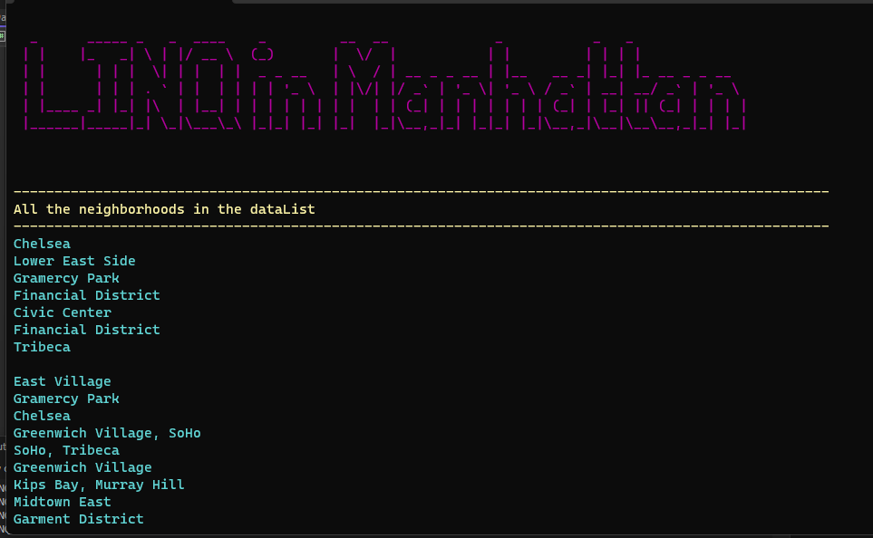

# LINQ-In-Manhatan

## Summary
+ LINQ_in_Manhattan is a program that demonstrates the usage of LINQ queries to read and manipulate data from a JSON file that represent some features in Manhattan. The module provides an example implementation to retrieve the neighborhood information from the JSON data using LINQ queries.

#
## Visuals
+ The program looks like this 

#
## How to use it
+ It's so simple just clone the repo to your device and open it in visual studio then run the program and see the features
